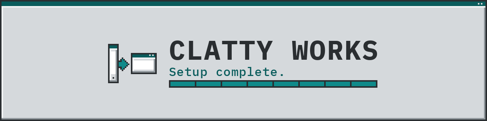

Setup complete.

Ports and faithful recreations between Android and Windows 11.

### What we offer

<table align="center">
  <tr>
    <td align="center" width="50%">
       
      <strong>Android to Windows 11</strong> 
      The same app, on Windows 11.
    </td>
    <td align="center" width="50%">
       
      <strong>Windows 11 to Android</strong> 
      The same app, on Android.
    </td>
  </tr>
  <tr>
    <td align="center" width="50%">
       
      <strong>Faithful recreations</strong> 
      It feels like the original.
    </td>
    <td align="center" width="50%">
       
      <strong>Documented builds</strong> 
      A build you can install.
    </td>
  </tr>
</table>

### Projects

<table>
  <tr>
    <td align="center">
      <strong><a href="https://github.com/contactjayclatty/flashwright">Flashwright</a></strong> 
      Update, root and flash Android phones on Windows 11, one guided wizard. 
      
      
    </td>
  </tr>
</table>

Android and Windows are trademarks of their respective owners.

**Clatty Works**

Setup complete.

