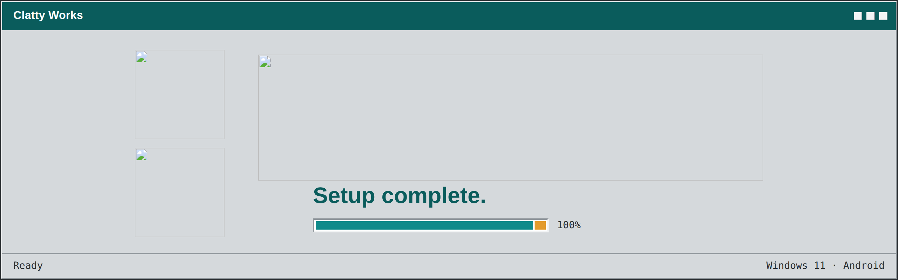
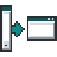

  

  
  
  

<h2 align="center">A studio that brings apps between Windows 11 and Android.</h2>

  We bring an app from one of those platforms to the other. 
  Same job, same feel, ready to install.

<h2 align="center">What we offer</h2>

<table>
  <tr>
    <td align="center" width="50%">
       
      <strong>Android to Windows 11</strong> 
      The same app, on Windows 11.
    </td>
    <td align="center" width="50%">
       
      <strong>Windows 11 to Android</strong> 
      The same app, on Android.
    </td>
  </tr>
  <tr>
    <td align="center" width="50%">
       
      <strong>Faithful recreations</strong> 
      It feels like the original.
    </td>
    <td align="center" width="50%">
       
      <strong>Ready to install</strong> 
      A build you can run.
    </td>
  </tr>
</table>

<h2 align="center">Projects</h2>

  <picture>
    <source media="(prefers-color-scheme: dark)" srcset="assets/flashwright/lockup-on-deep-teal.png">
    
  </picture>
   
  Update, root and flash an Android phone from Windows 11, in one guided wizard.
    
  

<table>
  <tr>
    <td width="50%" align="center">
      
    </td>
    <td width="50%" align="center">
      
    </td>
  </tr>
</table>

  <picture>
    <source media="(prefers-color-scheme: dark)" srcset="assets/logo/mark-white.png">
    
  </picture>
    
  <strong>Setup complete.</strong> 
  Made by Clatty Works.

